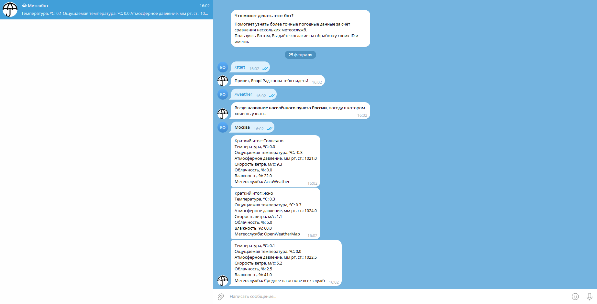

# Метеобот — легко масштабируемая погода в Телеграме


[](https://github.com/astral-sh/ruff)



## Из этого руководства Вы узнаете:

1. Как быстро начать работу — запустить проект «из коробки»
2. Как использовать продвинутую конфигурацию (требуются знания из ч. 1)

## Быстрый старт

Установка предельно проста:

```bash
git clone https://github.com/EgorOnishchuk/Meteobot
```

После клонирования репозитория Вам необходимо создать файл **.env** в корне проекта по шаблону из **.env.template**.
Далее — проверьте наличие актуальной версии **Docker** (настоятельно рекомендую воспользоваться [официальной 
инструкцией](https://docs.docker.com/engine/install/ "Документация Docker")).

И, наконец, выполните самую важную команду:

```bash
docker compose up
```

Теперь Ваш бот должен быть доступен в Телеграме. Журналы событий пишутся в _/var/lib/docker/containers/<ID 
контейнера>/*.log_, откуда могут быть собраны централизованными системами (например, _ELK_).

## Продвинутая конфигурация

Прежде чем дорабатывать модули приложения под себя следует кратко описать архитектуру. Моей целью было
создание Бота, который:

* полностью соответствует идеологии _MVP_
* разделён на слои _репозиторий — сервис — презентер — представление_, общающиеся через _DTO_
* совместим с различными _СУБД_, _ORM_ (её использование необязательно) и _валидаторами_
* не перегружен абстракциями: присутствует только то, в чём действительно есть необходимость

Рассмотрим три основных сценария написания собственной функциональности для нашего погодного агрегатора.

### Как перейти на другое хранилище данных?

Перейдём к **repositories.py**, расположенному в _model_: здесь находится репозиторий _Asyncpg_ (но Вы можете называть
его _DAO_ или как-то ещё — разница между ними весьма условная). Для максимальной производительности был выбран 
чистый SQL, но при появление новых сущностей, особенно CRUD, может потребоваться внедрение _SQLAlchemy_.

Сервис следует принципу _инверсии зависимостей_, а это значит, что для перехода на другое хранилище данных
(и даже необязательно БД: при необходимости всё можно хранить в файлах) достаточно:

1. Создать новый репозиторий
2. Изменить конфигурацию сервиса через _инъекцию зависимости_ Aiogram
3. По необходимости добавить промежуточное ПО (_middleware_), например, для внедрения сессии

### Как перейти на другого поставщика схем (Attrs, Marshmallow и т.д.)?

1. Создать новую схему — наследника Schema в **schemas.py**
2. Применить её к выходным и/или входным данным репозитория через соответствующие декораторы

### Как изменить формат представления?

Просто создать и подменить в презентере (в контексте фреймворка он называется «диспетчером») новый подкласс **View**.
Это может понадобиться, если Вы хотите отказаться от форматирования сообщений через _Markdown_ или 
поддерживать два разных представления.

### Авторы

* [Егор Онищук](https://gitlab.skillbox.ru/egor_onishchuk "Профиль в GitLab") — разработка, тестирование и
  документирование
